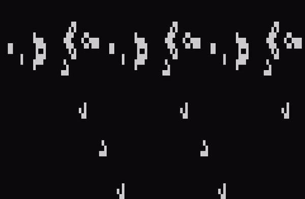

## ***Parallel implementaton - (OpenMP)***
# Conway's Game of Life

[click here](https://en.wikipedia.org/wiki/Conway%27s_Game_of_Life)

## Screenshot



## Build and Run

### Tools and libs
- gcc version 9.4.0
- openmp

### Run
```
 gcc -fopenmp main.c -o main && ./main
```

or

```
export OMP_NUM_THREADS=10 && ./main
```

## Support
 - Linux - (Ubuntu 2024)